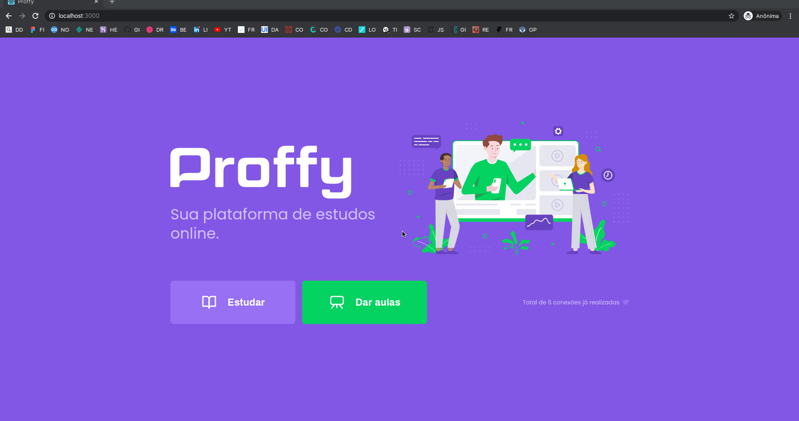

<h2 align="center">
Proffy - Plataforma de estudos online
<br/>
<br/>

<br/>

<br/>
<div style="display:flex">

</div>
<br/>

</h2>

<blockquote align="center">
  Projeto realizado durante a Next Level Week #02 da Rocketseat
</blockquote>

<hr/>

## :ballot_box_with_check: Objetivos:

Eu desenvolvi esse projeto durante a Next Level Week #02 da Rocketseat, com o intuito de reforçar meus conhecimentos na stack React, React Native e NodeJS.

## :book: Sobre:

O funcionamento da aplicação é simples, nessa parte web, o usuário que pode ser um professor ou aluno, logo na página inicial pode escolher entre duas opções: Dar aulas ou Estudar.

Em Dar aulas, o professor deve preencher um formulário com algumas informações básicas e algumas importantes como: o custo da sua aula, seu número para contato, a matéria a ser ensinada e os horários em que ele está disponível para lecionar essas aulas.

Já em Estudar, o aluno deve escolher em um filtro, qual a matéria a ser aprendida, assim como o dia da semana e também o horário. Ao buscar, a aplicação listará as informações de todos os professores e aulas disponíveis para aquelas condições, a partir desse ponto o usuário poderá entrar em contato pelo WhatsApp com o professor.

## 🎓 Aplicação de conhecimentos:

- Reforço de conhecimentos sobre o React
- Utilização dos hooks (useState e useEffect)
- Uso do TypeScript
- Navegação de rotas com react-router-dom
- Realização de chamadas na API com a lib axios


## 🚀 Tecnologias:

- React
- TypeScript

## 🖥️ Como executar:

Clone o repositório com:

```bash
git clone https://github.com/guihRovetta/proffy-web.git
```

Para baixar as dependências e instalar, utilize o comando na raiz do projeto:

```bash
yarn
```

Para rodar o projeto, execute:

```bash
yarn start
```

Lembrando que para poder salvar e acessar os dados do servidor, o projeto do back-end deve já estar rodando em sua máquina. Vale a pena notar também que nessa aplicação está sendo utilizada a porta <strong>3333</strong> do <strong>locahost</strong>.

## :new: Novas funcionalidades:

- [ ] Adição de página 404
- [ ] Novo layout de algumas páginas
- [x] Autenticação de usuários
- [x] Recuperação de senhas
- [ ] Exibição e edição de perfil do professor
- [ ] Paginação na listagem de professores
- [ ] Exibição de horários disponíveis dos professores (novo layout)
- [ ] Salvar professores favoritos
- [x] Logout da aplicação
- [ ] Deploy da aplicação

---

<h3 align="center">
Autor: <a alt="Guilherme Rovetta" href="https://github.com/guihRovetta">Guilherme Rovetta</a>
</h3>

<p align="center">

  <a alt="Guilherme de Almeida Rovetta Linkedin" href="https://www.linkedin.com/in/guilherme-rovetta-381a89b0">
  </a>
  <a alt="Guilherme de Almeida Rovetta GitHub" href="https://github.com/guihRovetta">
  </a>

</p>